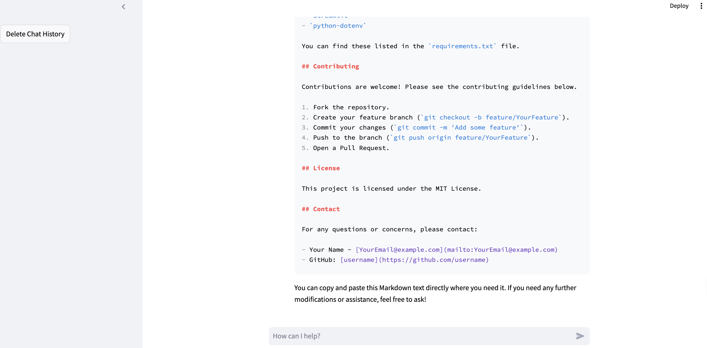

# It's Your Own Private ChatGPT

A Streamlit application that allows users to interact with an AI-powered chatbot using OpenAI's language model (GPT-4). This application can save the chat history, providing a seamless chat experience.



## Table of Contents

- [Features](#features)
- [Installation](#installation)
- [Usage](#usage)
- [Dependencies](#dependencies)
- [Contributing](#contributing)
- [License](#license)
- [Contact](#contact)

## Features

- Direct interaction with OpenAI's GPT-4 model.
- Chat history is saved locally, allowing users to review past conversations.
- Option to delete chat history for privacy.
- Clean and user-friendly interface using Streamlit.

## Installation

1. Clone the repository:
    ```bash
    git clone https://github.com/username/private-chatgpt.git
    ```
2. Navigate to the project directory:
    ```bash
    cd private-chatgpt
    ```
3. Install the required dependencies:
    ```bash
    pip install -r requirements.txt
    ```
4. Set your OpenAI API key in a `.env` file in the root directory:
    ```
    OPENAI_API_KEY=your_openai_api_key
    ```

## Usage

To run the application, use the following command:

```bash
streamlit run app.py
```
Replace `app.py` with the name of your main script file if it is different.

Once the application is running, open your web browser and navigate to [http://localhost:8501](http://localhost:8501) to start chatting with your AI assistant. You can input messages, and the model will respond accordingly.

## Interaction

- Type your message in the input box and press Enter to send.
- Your chat history will persist across sessions until deleted.

## Deleting Chat History

You can delete the chat history by clicking the "Delete Chat History" button in the sidebar. This action will remove all saved messages.

## Dependencies

This project requires the following Python packages:

- `openai`
- `streamlit`
- `python-dotenv`

You can find these listed in the `requirements.txt` file.

## Contributing

Contributions are welcome! Please see the contributing guidelines below.

1. Fork the repository.
2. Create your feature branch (`git checkout -b feature/YourFeature`).
3. Commit your changes (`git commit -m 'Add some feature'`).
4. Push to the branch (`git push origin feature/YourFeature`).
5. Open a Pull Request.

## License

This project is licensed under the MIT License.

